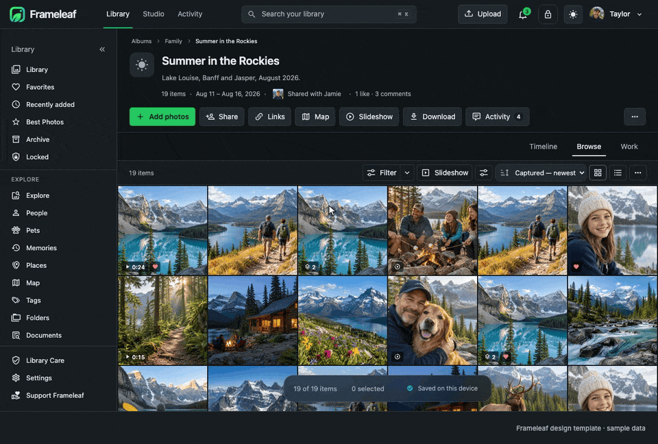
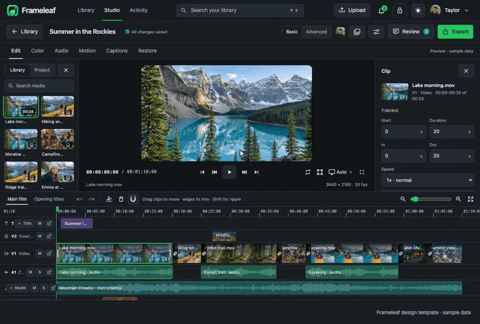

# Walkthrough animations

Captioned recordings of the [design template](../template/README.md) showing how Frameleaf works. Each GIF is a 960px preview; the matching MP4 is full resolution (1280 × 800 app plus caption band). The cursor and captions are added for the recording. Media, people and operational data are fictional, and exports, restoration and jobs are simulations — these are not backend, native or production-parity evidence.

## Library views



Browse's square grid → Timeline day groups → Work view → comparing a selection → light mode. [MP4](01-library-views.mp4)

## Search and filters


Search palette with live results → picking a person by face photo → text-in-photo search that finds a trail sign. [MP4](02-search-and-filters.mp4)

## Viewer and faces


Full-size viewer with details → arrow-key browsing → drawing a missed face and creating a new person. [MP4](03-viewer-and-faces.mp4)

## Quick edit to Studio


Trimming a clip in quick edit → continuing in Studio's multi-track timeline → previewing Creative 4× restoration on a LAN worker. [MP4](04-quick-edit-to-studio.mp4)

## Export and Activity



A simulated export job → pausing on disconnect and resuming on reconnect → returning to the same library selection. [MP4](05-export-and-activity.mp4)

## Command center


Settings overview → analytics scoped to one library → keyboard duplicate review with undo → restoring from Trash. [MP4](06-command-center.mp4)

## Regenerate

From `design/frameleaf/template`, after installing its dependencies:

```sh
pnpm exec playwright-core install chromium-headless-shell  # once
pnpm capture                       # captures and walkthroughs
pnpm capture stills                # only ../references captures
pnpm capture 03-viewer-and-faces   # one item by name
```

[`scripts/capture.mjs`](../template/scripts/capture.mjs) starts its own Vite server and drives the template in headless Chromium. It rewrites the prototype captures in [`../references`](../references/README.md) and the files here; walkthroughs also need `ffmpeg` and `gifski`. The planning studies (`reference-*.png`) are not regenerated.

The reference captures were regenerated from the September 24 template on 2026-09-25. [`source-manifest.json`](../source-manifest.json) still records the original FL-25 capture hashes; it is a reviewed, immutable record and is not rewritten.
