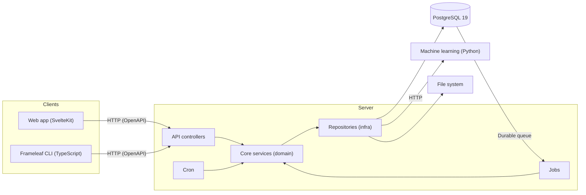

# Architecture

Frameleaf uses a traditional client-server design, with a dedicated database for data persistence. The frontend clients communicate with backend services over HTTP using REST APIs. Below is a high level diagram of the architecture.

## High Level Diagram

The server uses repository interfaces for PostgreSQL, machine learning and media storage. API and background workers share one canonical PostgreSQL 19 database. Queue claims, deduplication, dependencies, attempts and worker leases are durable rows; PostgreSQL LISTEN/NOTIFY wakes workers and carries Socket.IO broadcasts. Rate counters and token-fenced upload leases use bounded database pools. Transient counters, upload leases, attachment rows and worker memberships are cleared during recovery.

## Clients

Frameleaf has two clients in this repository:

1. Web app - Responsive website
2. CLI - Command-line utility for bulk upload

Frameleaf is building its own native iOS and Android apps; the inherited Flutter app has been removed from this repository. The server API is unchanged, so existing mobile clients can still connect.

:::info
Both clients use [OpenAPI](/api.md) to auto-generate rest clients for easy integration. For more information about this process, see [OpenAPI](/api.md).
:::

### Web Client

The web app is a [TypeScript](https://www.typescriptlang.org/) project that uses [SvelteKit](https://kit.svelte.dev) and [Tailwindcss](https://tailwindcss.com/).

### CLI

The Frameleaf CLI is an [npm](https://www.npmjs.com/) package that lets users control their Frameleaf instance from the command line. It uses the API to perform various tasks, especially uploading assets. See the [CLI documentation](/features/command-line-interface.md) for more information.

## Server

The Frameleaf backend is divided into several services, which are run as individual docker containers.

1. `immich-server` - Handle and respond to REST API requests, execute background jobs (thumbnail generation, metadata extraction, transcoding, etc.)
1. `immich-machine-learning` - Execute machine learning models
1. `postgres` - Canonical content, configuration, durable jobs and shared coordination

### Frameleaf server

The Frameleaf server is a [TypeScript](https://www.typescriptlang.org/) project written for [Node.js](https://nodejs.org/). It uses the [Nest.js](https://nestjs.com) framework, [Express](https://expressjs.com/) server, and the query builder [Kysely](https://kysely.dev/). The server codebase also loosely follows the [Hexagonal Architecture](<https://en.wikipedia.org/wiki/Hexagonal_architecture_(software)>). Specifically, we aim to separate technology specific implementations (`src/repositories`) from core business logic (`src/services`).

### API Endpoints

An incoming HTTP request is mapped to a controller (`src/controllers`). Controllers are collections of HTTP endpoints. Each controller usually implements the following CRUD operations for its respective resource type:

- `POST` `/<type>` - **Create**
- `GET` `/<type>` - **Read** (all)
- `GET` `/<type>/:id` - **Read** (by id)
- `PUT` `/<type>/:id` - **Updated** (by id)
- `DELETE` `/<type>/:id` - **Delete** (by id)

### Domain Transfer Objects (DTOs)

The server uses [Domain Transfer Objects](https://en.wikipedia.org/wiki/Data_transfer_object) as public interfaces for the inputs (query, params, and body) and outputs (response) for each endpoint. DTOs translate to [OpenAPI](/api.md) schemas and control the generated code used by each client.

### Background Jobs

Frameleaf uses a [worker](https://github.com/Frameleaf/frameleaf-app/blob/fork/main/server/src/utils/misc.ts) to run background jobs. These jobs include:

- Thumbnail Generation
- Metadata Extraction
- Video Transcoding
- Smart Search
- Facial Recognition
- Storage Template Migration
- Sidecar (see [XMP Sidecars](/features/xmp-sidecars.md))
- Background jobs (file deletion, user deletion)

:::info
This list closely matches what is available on the [Administration > Jobs](/administration/jobs-workers/#jobs) page, which provides some remote queue management capabilities.
:::

### Machine Learning

The machine learning service is written in [Python](https://www.python.org/) and uses [FastAPI](https://fastapi.tiangolo.com/) for HTTP communication.

All machine learning related operations have been externalized to this service, `immich-machine-learning`. Python is a natural choice for AI and machine learning. It also has some pretty specific hardware requirements. Running it as a separate container makes it possible to run the container on a separate machine, or easily disable it entirely.

Each request to the machine learning service contains the relevant metadata for the model task, model name, and so on. These settings are stored in Postgres along with other system configs. For each request, the microservices container fetches these settings in order to attach them to the request.

Internally, the machine learning service downloads, loads and configures the specified model for a given request before processing the text or image payload with it. Models that have been loaded are cached and reused across requests. A thread pool is used to process each request in a different thread so as not to block the async event loop.

All models are in ONNX format. This format has wide industry support, meaning that most other model formats can be exported to it and many hardware APIs support it. It's also quite fast.

Machine learning models are also quite _large_, requiring _quite a bit_ of memory. We are always looking for ways to improve and optimize this aspect of this container specifically.

### Postgres

Frameleaf persists data in Postgres, which includes information about access and authorization, users, albums, asset, sharing settings, etc.

:::info
See [Database Migrations](./database-migrations.md) for more information about how to modify the database to create an index, modify a table, add a new column, etc.
:::

### Shared PostgreSQL services

The canonical `public` schema contains one migration ledger (`frameleaf_migrations`), durable queue tables, offline-import checkpoints and shared-service coordination. Safe retry is an audited job policy; restoring a database never automatically replays a remote effect whose outcome is uncertain. PostgreSQL pgvector 0.8.7 provides HNSW indexes. A source Immich database is only read by the separate offline importer and never becomes the destination schema.
