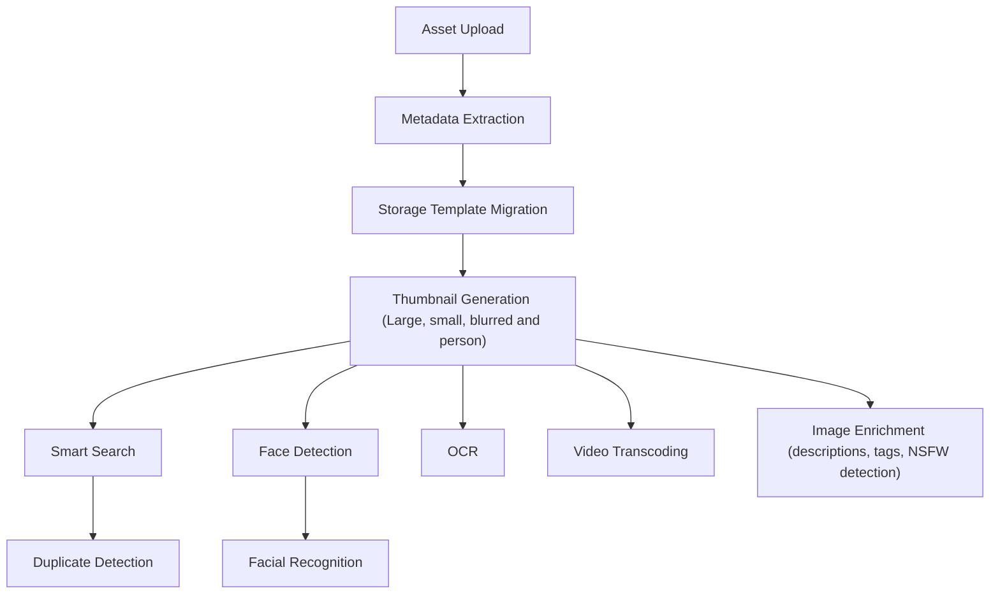

# Jobs and Workers

## Workers

### Architecture

The `frameleaf-server` container contains multiple workers:

- `api`: responds to API requests for data and files for the web and mobile app.
- `microservices`: handles most other work, such as thumbnail generation and video encoding, in the form of _jobs_. Simply put, a job is a request to process data in the background.
- `edge`: serves configured remote access and passes requests to `api`. It does nothing until remote access is turned on for a linked server.

By default `edge` runs wherever `api` runs: a container started with `FRAMELEAF_WORKERS_EXCLUDE: 'api'` does not run it. To run it without the API, name it in `FRAMELEAF_WORKERS_INCLUDE`, and give that container and the API's the same `FRAMELEAF_EDGE_SECRET`.

### Stopping the server

When the container stops (`docker compose stop`, an image upgrade or a NAS package restart), each worker stops taking new work. Running jobs and in-flight requests get a grace period to finish, 5 seconds by default (`FRAMELEAF_SHUTDOWN_GRACE_SECONDS`). The server exits by its deadline, 9 seconds by default (`FRAMELEAF_SHUTDOWN_DEADLINE_SECONDS`). Keep the container's stop timeout longer than that deadline; provided Compose and NAS configurations use 10 seconds.

PostgreSQL stores claims, attempts, run manifests and completed stages. Recovery permits one automatic retry of safe, repeatable media work after 30 seconds. Unsafe work, remote submissions and exhausted retries require attention. An interrupted item stays visible in the run; independent items continue. Restarting a server does not reset the retry budget.

An expired lease immediately prevents the old attempt from publishing. Automatic recovery also requires confirmation that the handler returned, or that its executor and registered native processes stopped. Recovery allows one additional 30-second sweep for the supervisor to persist that confirmation. If it remains unavailable, the item and any linked media operation require attention, and other items continue. Inspect the worker and host processes before explicitly resubmitting those items. A whole-host interruption can leave this state when no supervisor survived to record the stop.

### Execution deadlines

Each microservices worker admits up to eight jobs across all queues, derived from its ten-session execution database pool with two sessions of headroom. A queue's configured concurrency remains an upper limit; the shared worker limit may make its effective concurrency lower. The worker logs this capacity at startup and visits queues in rotation when capacity becomes available. Excess work remains queued and visible in run accounting without starting an attempt or spending a processing retry. The coordinator's heartbeat and cancellation queries use an independent pool.

Database publication is serialized locally before acquiring a connection. Waiting for local capacity does not count as processing progress. If a claimed job cannot enter the bounded local admission queue, it is deferred as `local-capacity` before its handler runs; cancellation removes queued admission immediately. Work cancelled after its claim fence is no longer valid stays under lease recovery, with stopped-attempt evidence retained.

The coordinator runs separately from media handlers. Claims last 60 seconds and renew every 15 seconds; reconciliation scans every 5 seconds and recovery sweeps every 30 seconds. Executor heartbeats prove responsiveness but do not count as media progress. Actual advancing bytes, frames or committed checkpoints extend the progress deadline. Repeated status messages do not.

| Environment setting              | Default                                         | Accepted milliseconds |
| -------------------------------- | ----------------------------------------------- | --------------------- |
| `FRAMELEAF_JOB_DEADLINE_MS`      | 600000 (10 minutes)                             | 1000–86400000         |
| `FRAMELEAF_ML_DEADLINE_MS`       | 1800000 (30 minutes, including response body)   | 1000–86400000         |
| `FRAMELEAF_JOB_IDLE_DEADLINE_MS` | 600000 (10 minutes without measurable progress) | 1000–86400000         |
| `FRAMELEAF_JOB_CANCEL_GRACE_MS`  | 10000 (10 seconds)                              | 1000–30000            |

Use the same settings in all server containers. Invalid, infinite, fractional or out-of-range values stop startup with the setting's name. Existing tighter operation-specific limits still apply. A progressing video, hash or backup can run beyond the ordinary deadline. An opaque handler has a fixed deadline. When cancellation does not stop an executor within its grace period, the supervisor terminates it before replacement work can publish results.

Generated media is prepared in an attempt-specific directory. Bounded maintenance slices run every minute and reclaim abandoned files only after a 24-hour grace period, confirmed execution stop, and checks for current media, revision, profile and backup references. Referenced files and attempts with unconfirmed termination remain protected. Detailed queue-history cleanup retains the stop evidence needed for later file cleanup.

## Split workers

If you prefer to throttle or distribute the workers, you can do this using the [environment variables](/install/environment-variables) to specify which container should pick up which tasks.

For example, for a simple setup with one container for the Web/API and one for all other microservices, you can do the following:

Copy the entire `frameleaf-server` block as a new service and make the following changes to the **copy**:

```diff
- frameleaf-server:
-   container_name: frameleaf_server
...
-   ports:
-     - 2283:2283
+ frameleaf-microservices:
+   container_name: frameleaf_microservices
```

Once you have two copies of the `frameleaf-server` service, make the following changes to each one. This will allow one container to only serve the web UI and API, and the other one to handle all other tasks.

```diff
services:
  frameleaf-server:
    ...
+   environment:
+     FRAMELEAF_WORKERS_INCLUDE: 'api'

  frameleaf-microservices:
    ...
+   environment:
+     FRAMELEAF_WORKERS_EXCLUDE: 'api'
```

## Machine-learning and restoration workers

Machine learning runs outside the server container, on the destinations listed under Administration > Processing destinations. Library analysis and restoration use separate workers, and restorations never take a job queue's concurrency slot. See [Workers and endpoints](/administration/workers-and-endpoints).

## Jobs

When a new asset is uploaded it kicks off a series of jobs, which include metadata extraction, thumbnail generation, machine learning tasks, image enrichment, and storage template migration, if enabled. To view the status of a job navigate to the Administration -> Jobs page.

Additionally, some jobs (such as memories generation) run on a schedule, which is every night at midnight by default. To change when they run or enable/disable a job navigate to System Settings -> Nightly Tasks Settings. That section has:

- **Start time**: when the server starts running the nightly tasks (default `00:00`).
- **Database cleanup tasks**: clean up old, expired data from the database.
- **Generate missing thumbnails**: queue assets without thumbnails for thumbnail generation.
- **Cluster new faces**: run facial recognition on newly detected faces.
- **Generate memories**: create new memories from assets.
- **Sync quota usage**: update user storage quota, based on current usage.

:::note
Some jobs ([External Libraries](/features/libraries) scanning, Database Dump) are configured in their own sections in System Settings.
:::

## Job processing order

The below diagram shows the job run order for newly uploaded files



## Image Enrichment Jobs

Image enrichment has separate backfill queues for `NSFW Detection` and `Image descriptions and tags`. Each queue can be run independently from `Administration > Jobs`, so you can classify NSFW images first, review the results, and then backfill generated descriptions and tags without toggling settings.

When both image descriptions and NSFW detection are enabled, newly uploaded images queue a description job after thumbnail generation. That job runs NSFW detection first when no stored NSFW result exists, then passes the result to the description model. If only NSFW detection is enabled, uploads queue the NSFW job directly.

Backfill jobs process image assets with generated previews and skip deleted, hidden, and locked assets. A normal backfill skips assets that already have a successful private result for that task. A forced backfill recalculates results, but generated descriptions and tags are still applied idempotently to avoid duplicate `AI description:` blocks or repeated tags.
