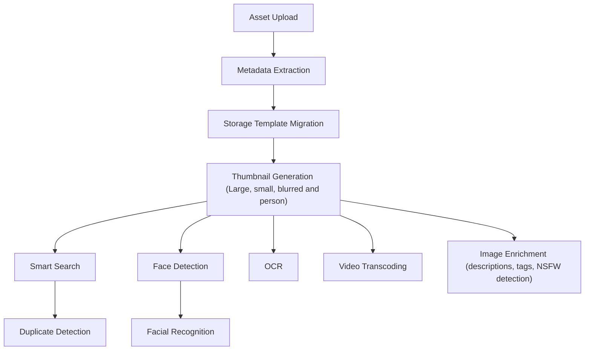

# Jobs and Workers

## Workers

### Architecture

The `immich-server` container contains multiple workers:

- `api`: responds to API requests for data and files for the web and mobile app.
- `microservices`: handles most other work, such as thumbnail generation and video encoding, in the form of _jobs_. Simply put, a job is a request to process data in the background.
- `edge`: serves configured remote access and passes requests to `api`. It does nothing until remote access is turned on for a linked server.

By default `edge` runs wherever `api` runs: a container started with `FRAMELEAF_WORKERS_EXCLUDE: 'api'` does not run it. To run it without the API, name it in `FRAMELEAF_WORKERS_INCLUDE`, and give that container and the API's the same `FRAMELEAF_EDGE_SECRET`.

### Stopping the server

When the container stops (`docker compose stop`, an image upgrade or a NAS package restart), each worker stops taking new work. Running jobs and in-flight requests get a grace period to finish, 5 seconds by default (`FRAMELEAF_SHUTDOWN_GRACE_SECONDS`). A job still running after that goes back to waiting, so it runs again as soon as the server is back. Jobs that could repeat a side effect if they ran twice, such as sending an email or a push notification, are recorded as failed instead. The server exits by its deadline, 9 seconds by default (`FRAMELEAF_SHUTDOWN_DEADLINE_SECONDS`).

Docker kills the container when its stop timeout ends, so the server's `stop_grace_period` must be longer than the deadline. The provided Compose files and NAS packages give the server container `stop_grace_period: 10s` (Unraid: `--stop-timeout=10`), which fits the defaults. Some Docker engines kill a container sooner by default, so keep this setting if you write your own Compose file, and raise it if you raise `FRAMELEAF_SHUTDOWN_DEADLINE_SECONDS`. If the server is killed or crashes, jobs that were running are picked up again about a minute after the next start.

## Split workers

If you prefer to throttle or distribute the workers, you can do this using the [environment variables](/install/environment-variables) to specify which container should pick up which tasks.

For example, for a simple setup with one container for the Web/API and one for all other microservices, you can do the following:

Copy the entire `immich-server` block as a new service and make the following changes to the **copy**:

```diff
- immich-server:
-   container_name: frameleaf_server
...
-   ports:
-     - 2283:2283
+ frameleaf-microservices:
+   container_name: frameleaf_microservices
```

Once you have two copies of the `immich-server` service, make the following changes to each one. This will allow one container to only serve the web UI and API, and the other one to handle all other tasks.

```diff
services:
  immich-server:
    ...
+   environment:
+     FRAMELEAF_WORKERS_INCLUDE: 'api'

  frameleaf-microservices:
    ...
+   environment:
+     FRAMELEAF_WORKERS_EXCLUDE: 'api'
```

## Machine-learning and restoration workers

Machine learning runs outside the server container, on the destinations listed under Administration > Processing destinations. Library analysis and restoration use separate workers, and restorations never take a job queue's concurrency slot. See [Workers and endpoints](/administration/workers-and-endpoints).

## Jobs

When a new asset is uploaded it kicks off a series of jobs, which include metadata extraction, thumbnail generation, machine learning tasks, image enrichment, and storage template migration, if enabled. To view the status of a job navigate to the Administration -> Jobs page.

Additionally, some jobs (such as memories generation) run on a schedule, which is every night at midnight by default. To change when they run or enable/disable a job navigate to System Settings -> Nightly Tasks Settings. That section has:

- **Start time**: when the server starts running the nightly tasks (default `00:00`).
- **Database cleanup tasks**: clean up old, expired data from the database.
- **Generate missing thumbnails**: queue assets without thumbnails for thumbnail generation.
- **Cluster new faces**: run facial recognition on newly detected faces.
- **Generate memories**: create new memories from assets.
- **Sync quota usage**: update user storage quota, based on current usage.

:::note
Some jobs ([External Libraries](/features/libraries) scanning, Database Dump) are configured in their own sections in System Settings.
:::

## Job processing order

The below diagram shows the job run order for newly uploaded files



## Image Enrichment Jobs

Image enrichment has separate backfill queues for `NSFW Detection` and `Image descriptions and tags`. Each queue can be run independently from `Administration > Jobs`, so you can classify NSFW images first, review the results, and then backfill generated descriptions and tags without toggling settings.

When both image descriptions and NSFW detection are enabled, newly uploaded images queue a description job after thumbnail generation. That job runs NSFW detection first when no stored NSFW result exists, then passes the result to the description model. If only NSFW detection is enabled, uploads queue the NSFW job directly.

Backfill jobs process image assets with generated previews and skip deleted, hidden, and locked assets. A normal backfill skips assets that already have a successful private result for that task. A forced backfill recalculates results, but generated descriptions and tags are still applied idempotently to avoid duplicate `AI description:` blocks or repeated tags.
